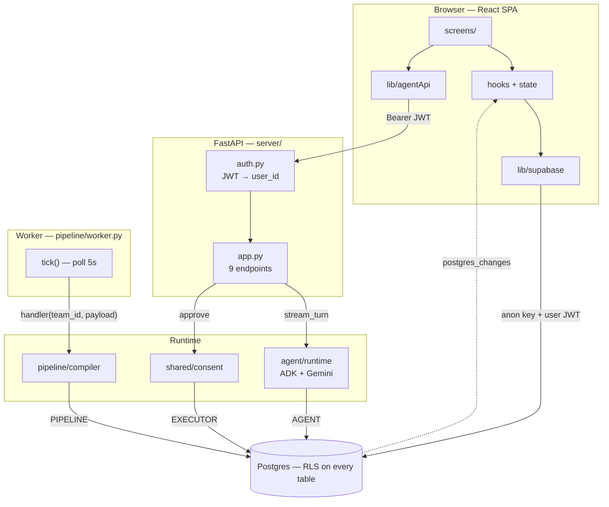
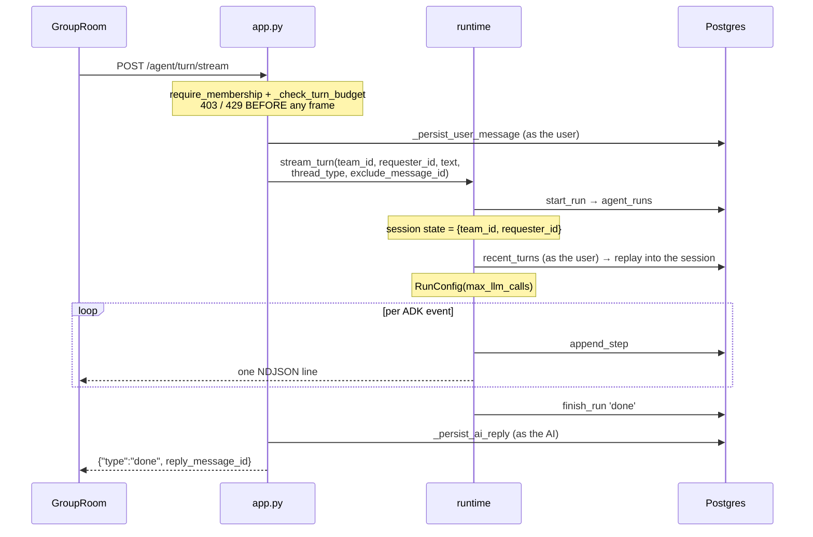
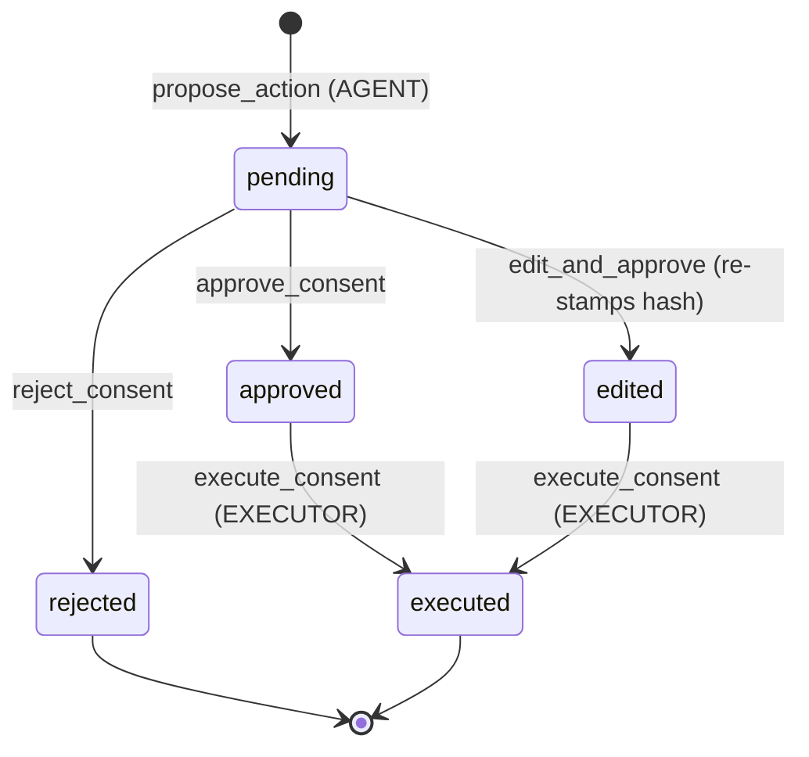
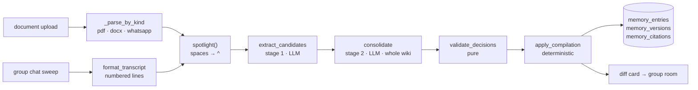

# Architecture

How Comrade fits together, and why the boundaries sit where they do.

Almost every read and write goes **browser → Postgres directly**, constrained by
row-level security. The FastAPI service exists only for the three things RLS cannot
express: running an agent turn (needs the Gemini key and the agent's DB role),
executing an approved consent item (needs the executor role), and enqueuing a
document job (members deliberately cannot write `jobs`).

---

## 1. The two invariants

**The agent never performs a group-visible action it chose itself.** It proposes; a
human approves; a separate database role executes. The agent role has no `INSERT` on
`tasks` and no `UPDATE` on `messages` — the restriction is enforced by grants, not by
convention. Two group-visible AI writes are not exceptions, because neither is the
agent acting on its own initiative: its reply when a member asks it something in the
room, and the memory compiler's diff card, which is a system notice.

**The model never supplies identity.** `stream_turn` injects `team_id` and
`requester_id` into ADK session state, and each tool reads them from
`tool_context.state`. They are never tool arguments, so the LLM cannot name another
team or attribute an action to someone else.

The one deliberate exception is `member_send_nudge`, which posts to a member's *own*
private thread without consent — the AI sends as itself, only the recipient sees it.
Because there is no human gate, `shared/nudge.py` enforces a 24-hour cooldown per
`(member, type, subject)` and the bodies are fixed templates, never LLM output.

---

## 2. The four database roles

`shared/db.py` is the only place a connection is opened. Every worker connects under
an RLS-enforced role — never `service_role` — and scopes itself to one team per
transaction with `SET LOCAL app.current_team_id`, which binds `current_team()` in the
policies.

| Role | Opened by | May do | Logged as |
|------|-----------|--------|-----------|
| `AGENT` | `agent_runs`, `nudge`, `propose_action`, AI replies | insert `consent_queue`; insert AI messages; own audit trail. **No read of team data** — see below | `ai` |
| `EXECUTOR` | `execute_consent` only | perform the approved write — `tasks` only | `ai` |
| `PIPELINE` | compiler, chat, `enqueue_document` | parse documents; write `memory_*`; enqueue jobs | `compiler` |
| `ADMIN` | job claim, cross-team sweep, tests | table owner; bypasses RLS — control-plane only | — |

`ADMIN` appears in the worker because claiming the next pending job scans *across*
teams and cannot be team-scoped. It is used only to pick work; the work itself runs
inside each handler under `team_session(PIPELINE, team_id)`, which is where RLS
enforces the data boundary.

`user_session()` is the fourth kind of connection and the most important one for
authorization: it does `SET ROLE authenticated` and sets `request.jwt.claims`, so RLS
applies exactly as it would for that user in the browser. Consent resolution runs
through it, which is why the API adds no permission logic of its own.

**The agent's reads run through it too** (findings §4.1, landed 2026-08-29). `AGENT`
held `SELECT` on `messages` scoped by *team*, not by *thread*, so it could read every
member's private thread — latent, since no tool exposed messages to the model, and
live the moment one did. The fix deleted the read grants rather than adding a
`thread_owner_id` clause: the agent borrows the requester's permissions for reads and
keeps its own identity only for writes. Its granted surface went from 21 tables to
five. Because `authenticated` has no `current_team()` to scope by, every moved query
carries an explicit `team_id` filter — that is scoping, not authorization.

All four connection kinds are **pooled** per role (`psycopg_pool`, findings §3.2).
Pooling is safe only because every scoping statement is transaction-scoped, so it
dies with the transaction and cannot reach the next borrower.

---

## 3. System map



The browser's wide path is the default. The narrow path through FastAPI exists only
where a key or a role must stay server-side. Realtime flows back the other way as
`postgres_changes` events — which is why no screen does an optimistic insert for an
agent reply.

---

## 4. An agent turn

Typing `@comrade` in the group room, or anything at all in a private thread, calls
`streamTurn`. The turn is delivered as newline-delimited JSON rather than SSE:
`EventSource` cannot send an Authorization header, and a token in the query string
would leak into logs.



Both guards run *before* the response starts, so a non-member still gets a real 403
and an over-budget team a real 429 — never a 200 whose first frame is an apology.
The user's message is written as the user (so RLS authorises it); the reply is
written as the AI and is never attributed to the requester.

`stream_turn` is the only orchestration in the module. `run_turn` drains it and
`run_turn_sync` wraps that in `asyncio.run`, so the batch path cannot drift from the
streaming one.

The ADK session is in-memory and per-turn, but it is no longer *empty*:
`agent/history.py:recent_turns` replays the last `AGENT_HISTORY_TURNS` messages of
**this thread** into it before the new message, so the agent remembers what you said
a message ago. History is read as the requesting member, and carries explicit
`team_id` / `thread_type` / `thread_owner_id` filters — `authenticated` may read both
the room and the member's own private thread, so keeping them apart is the query's
job, not RLS's. The just-persisted message is excluded by id, and tombstoned
(`deleted_scope`) messages never re-enter context. ADK's `DatabaseSessionService` is
deliberately not used: it needs SQLAlchemy, and its unqualified `sessions` / `events`
/ `app_states` / `user_states` tables would land in `public` with no RLS.

**Key functions:** `agent/runtime.py:57` `stream_turn` · `agent/agent.py:88`
`build_instruction` (rebuilds the wiki index per turn) · `agent/tools.py:124-217`
(the tools; there are 19 now, and `agent/registry.py` is the list that
decides what each may touch).

---

## 5. Consent

The agent only ever proposes. The `action_hash` binds `{tool, team, requester, args}`
into one token at propose time and re-verifies it at execute time, so what runs is
exactly what was approved — an edit is the only legitimate mutation, and it must
re-stamp the hash.



`execute_consent` puts the compare-and-swap claim **first** and every validation
after it — expiry, hash match, precondition. All of it sits in one
`EXECUTOR` transaction: a failed check raises `ConsentError`, the transaction rolls
back, and the row returns to `approved`. Validating before claiming would open a
window for two concurrent executions to both pass.

Tiers grade by blast radius. `_TOOL_TIER_FLOORS` sets a per-tool floor a proposal may
raise but never lower; `task_create` floors at T1, and it is the only registered tool
since `post_group_message` was removed (findings §13). T3 and its two-key countersign
were removed on 2026-08-12 (findings §10) — `tier` survives, narrowed to T0–T2, as an
informational label and as the seed for the earned-trust ratchet. For code, GitHub
branch protection is the stronger second key; for non-code actions, nothing replaces
it yet.

**Key functions:** `shared/consent.py` `propose_action` · `execute_consent` ·
`approve_consent`.

---

## 6. Memory: documents and chat

Both paths share stages 2 and 3; only extraction differs.



`spotlight()` is the prompt-injection boundary. Every character of untrusted text —
documents *and* chat — has its spaces replaced with `^` before any LLM call, and the
compiler's system prompt declares that marking, so the model treats the span as data
rather than instructions.

Stage 1 sees the document **alone**, with no existing-fact context, so recall does not
degrade as the team's memory grows. Stage 2 sees the whole wiki grouped by page and
picks one action per candidate. `validate_decisions` then degrades anything malformed
to `add` — a candidate is never silently dropped.

`apply_compilation` writes in four verbs with bi-temporal supersession. `add` creates
an entry on a resolved page; `revise` and `invalidate` close the current version
(`is_active=false, valid_until=now()`) and write a successor; `noop` just counts. An
`invalidate` successor is a tombstone — never active, closed immediately — so the
retraction text and its citation stay on the entry and history shows why the fact
died. **Nothing is ever deleted.**

Chat capture is ambient: `tick()` drains the job queue, then sweeps every team whose
group chat has at least five new messages past the last watermark. The compile job
carries message *ids*, not bodies, and re-fetches them at handler time — so a message
deleted between enqueue and execution simply drops out. `apply_compilation` always
writes the compilation row, so the watermark advances even on pure chitchat and the
sweep never rescans it.

**Key functions:** `pipeline/compiler.py:114` `extract_candidates` · `:195`
`consolidate` · `:240` `apply_compilation` · `pipeline/chat.py:122`
`sweep_chat_compiles`.

---

## 7. Frontend

Two providers wrap everything: `AuthProvider` owns the Supabase session and
bootstraps a `profiles` row; `TeamProvider` owns the roster and is remounted per
`:teamId`. Screens never query Supabase for shared state — they go through
`useMessages`, `useTasks`, and `useTeam`, and every one subscribes to realtime.

`useTeamRealtime` gives each caller a uniquely-named channel via `useId`: supabase-js
returns the *existing* channel object for a repeated name, and attaching a handler to
an already-subscribed channel throws — so the sidebar badge and the consent inbox
watching the same table must not collide.

View-model logic lives in pure, unit-tested modules under `lib/` — `taskFlow`,
`consentModel`, `roomModel`, `wikiModel`, `format`. These **mirror** server policy for
rendering and never replace it: `taskFlow` decides which button to show, while the DB
trigger remains the authority on who may actually confirm a task.

---

## 8. Deletion leaves a trace

Three separate paths honour the same invariant:

- A member deleting their own message sets `deleted_scope='everyone'` with
  `deleted_by` and `deleted_at`. The row stays, and `classifyMessage` renders it as a
  visible tombstone rather than a silent gap.
- Suppressing a proactive AI observation tombstones the message through a definer
  function — the agent role has no `UPDATE` on messages. Memory diff cards are
  explicitly excluded: they are notifications, not observations, and silencing them
  would break the transparency that replaces a memory approval gate.
- `apply_compilation` never removes a fact; invalidation writes a closed successor
  version.

---

## 9. Migration policy

In force from `20260829090000_agent_group_reply.sql` onward (findings doc §8, §16.5):

- Any index on an **existing** table uses `CREATE INDEX CONCURRENTLY`, in its own
  migration file with no surrounding transaction.
- Any check constraint on an **existing** table is added `NOT VALID` first, then
  `VALIDATE CONSTRAINT` as a separate statement.

Most `create index` statements in the tree run in the same migration that creates the
(empty) table, which is safe and needs no change. Two prior violations are left in
place because the tables were small at the time:
`20260719090000_production_hardening.sql:10` builds `idx_jobs_lease_expiry` on the
existing `jobs` table without `CONCURRENTLY`, and `20260719130000_consent_tiers.sql`
adds check-constrained columns to the existing `consent_queue` directly.

`uuidv7()` for new high-write tables stays deferred: the local stack is PostgreSQL 17
and the function arrives in 18.

### A trap every new table falls into

Supabase grants `anon` and `authenticated` **full CRUD on every new table by
default**. A `create table` in a migration is therefore open until explicitly
closed, and enabling RLS alone is not enough — it only helps because no policy
names those roles.

So every new table needs, explicitly:

```sql
alter table public.<t> enable row level security;
revoke all on public.<t> from anon, authenticated;
grant <the minimum> on public.<t> to <the worker role that needs it>;
```

This is how `agent_steps` (2026-08-30) avoided re-opening the private-thread
leak that `agent_runs` had: it holds the same content — tool arguments and
results from private turns — in a new table, and the default grant would have
handed it straight back to every teammate.

Current state: `anon` holds the default grants on all 25 public tables, RLS is
on for all of them, and **no policy names `anon`**, so it is default-denied
everywhere. That is the pre-existing convention rather than a hole, but the
grants are dead privilege and a future permissive policy would activate them.
Worth a hygiene pass; not urgent.

### Views are not covered by RLS

Row-level security protects **tables**. A view has no policies of its own and,
unless told otherwise, runs with the privileges of its **owner** —
`security_invoker` defaults to off. A view over RLS-protected tables, owned by
a superuser and granted to `authenticated`, therefore bypasses every policy
beneath it.

`contribution_v` was exactly that until 2026-08-31: a member of one team could
read every team's rows from it.

**The rule for any view over RLS-protected tables — it must do one of two things:**

1. **Run as its caller** — `alter view … set (security_invoker = on)` — so the
   underlying policies apply. This is the default choice.
2. **Scope itself**, deliberately, when it must aggregate rows the caller may
   not read individually. `document_opens_summary` is this kind: it answers
   "opened by 3 of 4" without naming who, over a `document_opens` table that is
   private per member, so it runs as owner and carries
   `where is_team_member(d.team_id)` itself.

Choosing (2) by accident is the bug; choosing it on purpose, with the predicate
written down, is a design.

**And on a view, the GRANT is the whole boundary** — there is no RLS behind it.
Supabase's default grants reach views as well as tables, so `anon` must be
revoked explicitly. `tests/test_view_isolation.py` asserts both halves.

## Team lifecycle (D4)

### Leaving is an UPDATE, not a DELETE

`memberships.status` gained `'left'`, and `left_at` records when. The row
survives because deletion leaves a trace: a departed member's messages and
tasks keep an author the roster can still resolve, and the row is the record
that they were here.

### The state machine lives in a trigger, not a policy

A policy decides **which rows** you may touch; it cannot compare OLD with NEW,
so it cannot say "active → left but never left → active". Without that,
`'left'` would open a bigger hole than it closes — `au_memberships_update`
already lets you write your own row, so a departed member could set themselves
back to `'active'` and every policy in the schema would believe them again.

`trg_membership_identity_guard` holds the whole machine:

| from | to | who |
|---|---|---|
| `invited` | `active` | the invitee |
| `active` | `left` | that member, and nobody else |
| `left` | `invited` | an active leader, inviting them back |

Note what is **absent**: no `active → left` by anyone but you. That absence is
the §23.1 guarantee, stated once, where every writer passes through.

### Nobody has a remove button

A teammate can only **ask**. `POST /teams/{id}/members/{uid}/departure-request`
files a consent proposal whose `requesting_member_id` is *the person being
asked* — so `au_consent_queue_update` makes their key the only one that
resolves it, and the asker cannot even see the card.

That makes `_exec_member_depart`'s identity check load-bearing rather than
decorative: if `args` could name someone else, an asker would file against a
teammate, approve with their own key, and the consent queue would have become
the admin power it replaces. Checked at **execute** time, not just propose
time, because `edit_and_approve` re-stamps the hash.

### `AGENT_PROPOSABLE` ≠ `_EXECUTORS`

`team_propose_batch` is the one place a tool name chosen by the **model**
reaches the consent queue. Until `member_depart` existed, `propose_action`'s
`not in _EXECUTORS` check happened to reject everything unexpected —
accidental validation from a two-entry map. The sets are now separate and
named. `member_depart` must never enter `AGENT_PROPOSABLE`.

### A team ends when its last member leaves

There is no delete-team button. A team with no active members is *already*
invisible to everyone, so a delete would be a second mechanism for a state the
schema reaches on its own — and an admin power besides. `teams.archived_at`
supplies the missing piece, which was the trace, and clears if anyone rejoins.

The same trigger passes leadership to the longest-standing remaining member.
Without it D4 would ship a trap: the leader is the only one who can invite and
rename, so a founding leader leaving would strand the team permanently.
Succession is exempt from `trg_membership_role_guard` via `pg_trigger_depth()`
— unforgeable, unlike a `set_config` flag any caller could set before their own
UPDATE.

### A team you are not in redirects

`TeamContext` reports `access: 'unknown' | 'ok' | 'denied'`, and `'denied'`
means *the server said you are not in the active roster* — never a failed
request. Two supported paths reach a team shell you cannot use: leaving and
pressing Back, and a stale `comrade.teamId` pointing at a team that is gone.
Both used to render a complete, entirely empty shell with no explanation.

### Realtime needs the whole row, not just the key

Adding a table to the `supabase_realtime` publication is necessary and **not
sufficient**. Realtime applies each table's RLS SELECT policy per subscriber,
and it does that against the row *as it appears in the WAL* — not by reading it
back. With the default replica identity the WAL carries only the primary key,
so the policy has no `team_id` to test, the check cannot pass, and every row is
dropped.

Silently. The subscription is healthy, the INSERT succeeds, no event arrives —
and because every screen also refetches on focus, it reads as latency rather
than breakage.

**So a published table must also be `replica identity full`**, and
`tests/test_migration_realtime_publication.py` asserts the two together.
Publishing a table without it re-creates the bug.

## The turn shows its work (D6)

`stream_turn` emits a frame per event; the screens are what decide whether the
member ever sees one. Three kinds of silence were reaching them as an
indistinguishable "spinner stops, nothing happens":

| frame | what it means | before D6 |
|---|---|---|
| `tool_call` | the agent is doing a specific thing | GroupRoom dropped it; PrivateThread printed the raw tool id |
| `busy` | the room's turn lock is held (Q6) | not in `StreamFrame`; silently dropped |
| `empty` | the model returned nothing at all | did not exist — the run was marked `done` |

**`empty` is the serious one.** Measured 2026-08-31 against the live model,
six of fourteen consecutive turns came back with *no events at all* — no tool
calls, no text. `server/app.py` persists a reply only `if reply`, so nothing
was written, nothing rendered, and `agent_runs.status` said `done`. A member
asked Comrade a question and got silence recorded as a success.

An empty turn is now a **failed** turn — `failed` rather than a new status,
because from the product's side "raised an exception" and "produced no answer"
are the same event — and it yields a frame saying so.

**The rule this leaves:** every path out of `stream_turn` that does not produce
a reply must emit a frame the member can see, and `run_turn` must handle it —
it reads `final["run_id"]`, so a new terminal frame without a branch there is a
`KeyError` inside the HTTP handler.

### And the root cause, 2026-09-01

Instrumented against the live model, an empty turn is a single event:

```
finish_reason  STOP        error_code  None      n_parts  0
content        not None    prompt_token_count  3180
                           total_token_count   3180   ← zero output tokens
```

Gemini intermittently returns a candidate with an **empty parts list** and a
perfectly normal STOP. No safety block, no truncation, no error, no exception —
it was handed 3180 tokens of prompt and generated none. Measured 1 in 8.

**So the turn is re-asked, up to `EMPTY_TURN_ATTEMPTS`.** Retrying is safe here
and would not be anywhere else, and that is the whole argument: *an empty turn
has no side effects by definition* — no tool ran, nothing was written, nothing
was yielded to the caller. The guard is `if all_steps`, **not** `if reply`: a
turn that called a tool and then went quiet must never be retried, or the tool
runs twice.

Measured after: 14/14 turns ended with a reply. The `empty` frame stays as the
backstop for a model that is persistently silent, which is systematic rather
than unlucky.

And a test that asserts the model spoke is testing the model. `journeys.spec.ts`
now accepts a reply *or* the empty-turn note; a blank screen fails both.
