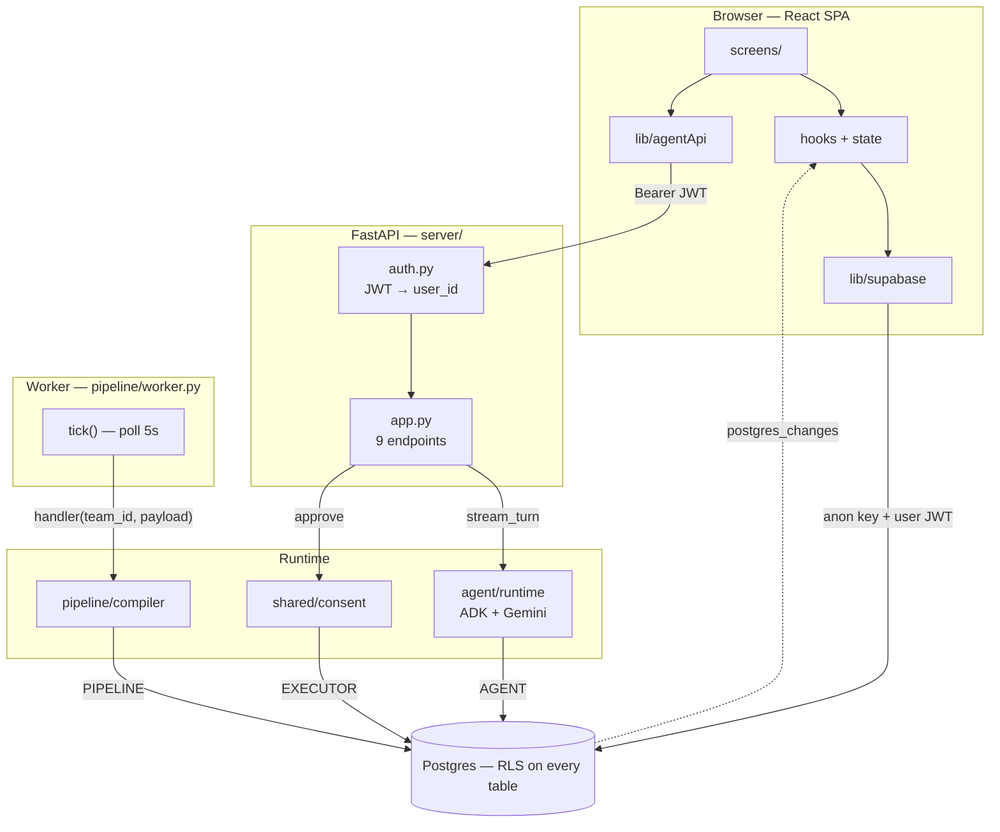
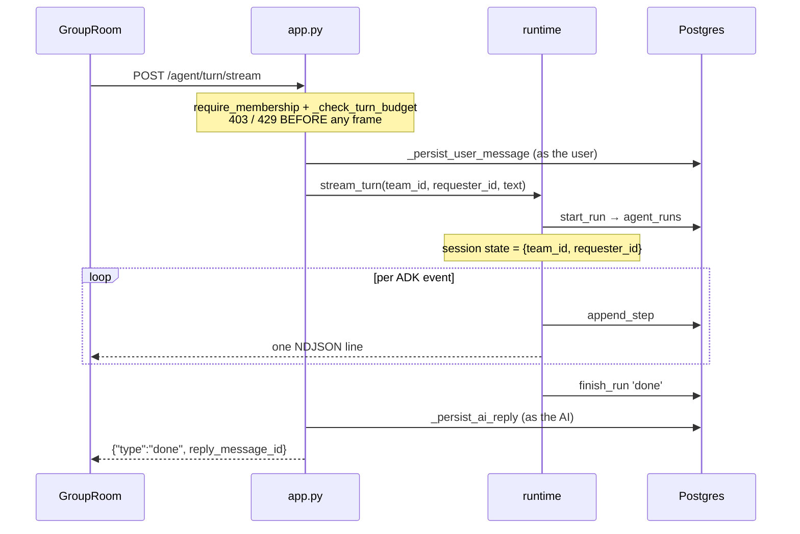
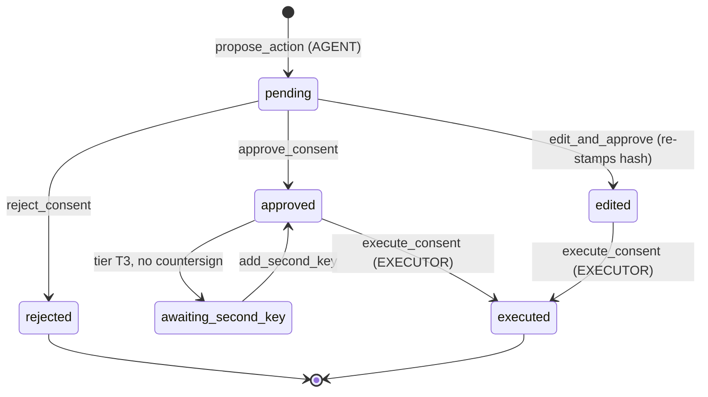
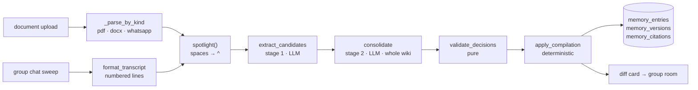

# Architecture

How Comrade fits together, and why the boundaries sit where they do.

Almost every read and write goes **browser → Postgres directly**, constrained by
row-level security. The FastAPI service exists only for the three things RLS cannot
express: running an agent turn (needs the Gemini key and the agent's DB role),
executing an approved consent item (needs the executor role), and enqueuing a
document job (members deliberately cannot write `jobs`).

---

## 1. The two invariants

**The agent never performs a group-visible write.** It proposes; a human approves; a
separate database role executes. The agent role has no `INSERT` on `tasks` and no
`UPDATE` on `messages` — the restriction is enforced by grants, not by convention.

**The model never supplies identity.** `stream_turn` injects `team_id` and
`requester_id` into ADK session state, and each tool reads them from
`tool_context.state`. They are never tool arguments, so the LLM cannot name another
team or attribute an action to someone else.

The one deliberate exception is `member_send_nudge`, which posts to a member's *own*
private thread without consent — the AI sends as itself, only the recipient sees it.
Because there is no human gate, `shared/nudge.py` enforces a 24-hour cooldown per
`(member, type, subject)` and the bodies are fixed templates, never LLM output.

---

## 2. The four database roles

`shared/db.py` is the only place a connection is opened. Every worker connects under
an RLS-enforced role — never `service_role` — and scopes itself to one team per
transaction with `SET LOCAL app.current_team_id`, which binds `current_team()` in the
policies.

| Role | Opened by | May do | Logged as |
|------|-----------|--------|-----------|
| `AGENT` | tools, `agent_runs`, `nudge`, `propose_action` | read team state; insert `consent_queue`; insert private AI messages | `ai` |
| `EXECUTOR` | `execute_consent` only | perform the approved write — tasks, group messages | `ai` |
| `PIPELINE` | compiler, chat, `enqueue_document` | parse documents; write `memory_*`; enqueue jobs | `compiler` |
| `ADMIN` | job claim, cross-team sweep, tests | table owner; bypasses RLS — control-plane only | — |

`ADMIN` appears in the worker because claiming the next pending job scans *across*
teams and cannot be team-scoped. It is used only to pick work; the work itself runs
inside each handler under `team_session(PIPELINE, team_id)`, which is where RLS
enforces the data boundary.

`user_session()` is the fourth kind of connection and the most important one for
authorization: it does `SET ROLE authenticated` and sets `request.jwt.claims`, so RLS
applies exactly as it would for that user in the browser. Consent resolution runs
through it, which is why the API adds no permission logic of its own.

---

## 3. System map

The browser's wide path is the default. The narrow path through FastAPI exists only
where a key or a role must stay server-side. Realtime flows back the other way as
`postgres_changes` events — which is why no screen does an optimistic insert for an
agent reply.

---

## 4. An agent turn

Typing `@comrade` in the group room, or anything at all in a private thread, calls
`streamTurn`. The turn is delivered as newline-delimited JSON rather than SSE:
`EventSource` cannot send an Authorization header, and a token in the query string
would leak into logs.

Both guards run *before* the response starts, so a non-member still gets a real 403
and an over-budget team a real 429 — never a 200 whose first frame is an apology.
The user's message is written as the user (so RLS authorises it); the reply is
written as the AI and is never attributed to the requester.

`stream_turn` is the only orchestration in the module. `run_turn` drains it and
`run_turn_sync` wraps that in `asyncio.run`, so the batch path cannot drift from the
streaming one.

**Key functions:** `agent/runtime.py:57` `stream_turn` · `agent/agent.py:88`
`build_instruction` (rebuilds the wiki index per turn) · `agent/tools.py:124-217`
(the five tools).

---

## 5. Consent

The agent only ever proposes. The `action_hash` binds `{tool, team, requester, args}`
into one token at propose time and re-verifies it at execute time, so what runs is
exactly what was approved — an edit is the only legitimate mutation, and it must
re-stamp the hash.

`execute_consent` puts the compare-and-swap claim **first** and every validation
after it — expiry, T3 second key, hash match, precondition. All of it sits in one
`EXECUTOR` transaction: a failed check raises `ConsentError`, the transaction rolls
back, and the row returns to `approved`. Validating before claiming would open a
window for two concurrent executions to both pass.

Tiers grade by blast radius. `_TOOL_TIER_FLOORS` sets a per-tool floor a proposal may
raise but never lower: `task_create` floors at T1, `post_group_message` at T2.
Anything money-moving or outbound to non-members must be registered at T3, which is a
hard two-key gate — and the second key is never the initiator.

**Key functions:** `shared/consent.py:64` `propose_action` · `:95` `execute_consent` ·
`:147` `approve_consent` · `:169` `add_second_key`.

---

## 6. Memory: documents and chat

Both paths share stages 2 and 3; only extraction differs.

`spotlight()` is the prompt-injection boundary. Every character of untrusted text —
documents *and* chat — has its spaces replaced with `^` before any LLM call, and the
compiler's system prompt declares that marking, so the model treats the span as data
rather than instructions.

Stage 1 sees the document **alone**, with no existing-fact context, so recall does not
degrade as the team's memory grows. Stage 2 sees the whole wiki grouped by page and
picks one action per candidate. `validate_decisions` then degrades anything malformed
to `add` — a candidate is never silently dropped.

`apply_compilation` writes in four verbs with bi-temporal supersession. `add` creates
an entry on a resolved page; `revise` and `invalidate` close the current version
(`is_active=false, valid_until=now()`) and write a successor; `noop` just counts. An
`invalidate` successor is a tombstone — never active, closed immediately — so the
retraction text and its citation stay on the entry and history shows why the fact
died. **Nothing is ever deleted.**

Chat capture is ambient: `tick()` drains the job queue, then sweeps every team whose
group chat has at least five new messages past the last watermark. The compile job
carries message *ids*, not bodies, and re-fetches them at handler time — so a message
deleted between enqueue and execution simply drops out. `apply_compilation` always
writes the compilation row, so the watermark advances even on pure chitchat and the
sweep never rescans it.

**Key functions:** `pipeline/compiler.py:114` `extract_candidates` · `:195`
`consolidate` · `:240` `apply_compilation` · `pipeline/chat.py:122`
`sweep_chat_compiles`.

---

## 7. Frontend

Two providers wrap everything: `AuthProvider` owns the Supabase session and
bootstraps a `profiles` row; `TeamProvider` owns the roster and is remounted per
`:teamId`. Screens never query Supabase for shared state — they go through
`useMessages`, `useTasks`, and `useTeam`, and every one subscribes to realtime.

`useTeamRealtime` gives each caller a uniquely-named channel via `useId`: supabase-js
returns the *existing* channel object for a repeated name, and attaching a handler to
an already-subscribed channel throws — so the sidebar badge and the consent inbox
watching the same table must not collide.

View-model logic lives in pure, unit-tested modules under `lib/` — `taskFlow`,
`consentModel`, `roomModel`, `wikiModel`, `format`. These **mirror** server policy for
rendering and never replace it: `taskFlow` decides which button to show, while the DB
trigger remains the authority on who may actually confirm a task.

---

## 8. Deletion leaves a trace

Three separate paths honour the same invariant:

- A member deleting their own message sets `deleted_scope='everyone'` with
  `deleted_by` and `deleted_at`. The row stays, and `classifyMessage` renders it as a
  visible tombstone rather than a silent gap.
- Suppressing a proactive AI observation tombstones the message through a definer
  function — the agent role has no `UPDATE` on messages. Memory diff cards are
  explicitly excluded: they are notifications, not observations, and silencing them
  would break the transparency that replaces a memory approval gate.
- `apply_compilation` never removes a fact; invalidation writes a closed successor
  version.

---

## 9. Migration policy

In force from `20260829090000_agent_group_reply.sql` onward (findings doc §8, §16.5):

- Any index on an **existing** table uses `CREATE INDEX CONCURRENTLY`, in its own
  migration file with no surrounding transaction.
- Any check constraint on an **existing** table is added `NOT VALID` first, then
  `VALIDATE CONSTRAINT` as a separate statement.

Most `create index` statements in the tree run in the same migration that creates the
(empty) table, which is safe and needs no change. Two prior violations are left in
place because the tables were small at the time:
`20260719090000_production_hardening.sql:10` builds `idx_jobs_lease_expiry` on the
existing `jobs` table without `CONCURRENTLY`, and `20260719130000_consent_tiers.sql`
adds check-constrained columns to the existing `consent_queue` directly.

`uuidv7()` for new high-write tables stays deferred: the local stack is PostgreSQL 17
and the function arrives in 18.
