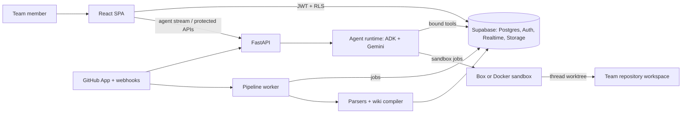

# Comrade architecture

## Purpose and design rules

Comrade helps an engineering team retain shared context and safely turn that context into work. It is deliberately a **multiplayer harness**, not an individual coding assistant with a chat room attached.

Two rules shape the implementation:

1. **The model never supplies identity.** The server obtains the authenticated user from the JWT and binds `team_id` and `requester_id` into agent session state. Tools read those bound values; an LLM cannot redirect a request to another team or impersonate a member.
2. **The agent proposes; people approve; a separate role executes.** The agent cannot directly perform a consequential group-visible mutation. An approval is tied to a hash of the tool, team, requester, and arguments, then executed separately.

## System map

The browser uses Supabase directly for normal product reads and writes. FastAPI exists for capabilities that must not reach the browser: model access, agent orchestration, GitHub installation credentials, approval execution, and privileged job creation. Realtime database changes update other connected members.

## Frontend

`frontend/` is a React, TypeScript, and Vite SPA.

| Area | Responsibility |
|---|---|
| `state/AuthContext.tsx` | Supabase session and authenticated member identity. |
| `state/TeamContext.tsx` | Selected team and membership context. |
| `screens/` | Team gate, rooms, threads, tasks, wiki, documents, setup, and GitHub callback. |
| `components/` | Composer, thread sidebar, consent cards, GitHub connection, memory diffs, and agent activity/diff display. |
| `hooks/useThreads.ts` | Lists member-visible threads and creates a default public thread. |
| `hooks/useMessages.ts`, `useRealtime.ts` | Database reads plus realtime reconciliation. |
| `lib/supabase.ts` | Browser Supabase client; browser permissions always rely on RLS. |
| `lib/agentApi.ts` | Authenticated NDJSON agent stream and durable run-history retrieval. |

### Threads and agent interaction

A sidebar button creates a public `New thread` immediately. The first agent-directed message assigns its title, avoiding a setup modal. Team-visible and restricted threads are both stored in `threads`; RLS determines which metadata and messages a member can see.

`GroupRoom` submits a turn with `POST /agent/turn`, carrying a client request id that identifies the attempt, then watches the run with `GET /agent/runs/{id}/stream?after_seq=`. Submitting and watching are separate calls so that attaching, reattaching after a dropped connection, and rejoining after a refresh are all the same request from a cursor. The stream is newline-delimited JSON because a normal `fetch` can retain the Authorization header, and it carries lifecycle frames (`run`, `status`, `done`) apart from content frames (`text`, `tool_call`, `tool_result`) so a run waiting on a person is not mistaken for one that finished. A stream that ends without a terminal frame is treated as truncated and reattached, never as a completed turn. The request id makes the retry safe: uniqueness on `(team_id, sender_id, thread_id, client_request_id)` binds a retried submission to the message and run already accepted. Tool calls, tool output, and patch results become expandable `AgentActivity` cards; durable `agent_runs` and `agent_steps` are what the thread recovers from.

The member who asked for a turn can stop it: `POST /agent/runs/{id}/cancel` requires both thread access (the run is yours to see) and requester ownership (it is yours to stop), and the loop checks between steps so a stop reaches the next model and tool call rather than letting the turn run to its natural end. A command already running inside a container is polled about once a second and killed, so stopping a turn does not leave a test suite holding a host CPU. A turn parked on a consent card releases its worker lease — that lease detects a dead process in minutes, and a person deciding takes minutes to days — so the backstop is the card's own expiry. Approve, edit and reject all resume the same logical run, and the room rejoins it.

## Database, auth, and tenancy

Supabase provides Postgres, Auth, Realtime, and Storage. SQL migrations in `supabase/migrations/` define tables, constraints, RLS policies, functions, indexes, and realtime publication.

### Core data domains

| Domain | Main records |
|---|---|
| Teams | `profiles`, `teams`, `memberships`, invitations, lifecycle and activity records. |
| Conversations | `threads`, participants, `messages`, thread plans, agent run queue, effects, and durable run steps. |
| Work and consent | tasks, `consent_queue`, permission grants, action provenance, and audit data. |
| Memory | documents, parsed content, memory entries/versions/citations/comments/pages, compiler batches. |
| Repository | GitHub installations/repos/activity, per-repository environment state, and thread workspaces. |
| Usage | hourly usage buckets and reservations used to enforce per-team model limits atomically. |

RLS is the primary authorization boundary. A FastAPI check is never the only authorization check where the browser could access PostgREST directly.

### Database roles

| Role | Purpose |
|---|---|
| `authenticated` | Browser/member access through Supabase JWT claims and RLS. |
| `comrade_agent` | Agent-owned writes such as runs, messages, and proposals; reads borrow requester permissions. |
| `comrade_executor` | Executes an approved, hash-verified action. |
| `comrade_pipeline` | Parses content, compiles memory, and handles team-scoped pipeline work. |
| `comrade_control` | Narrow cross-team control-plane actions such as queue claiming. |
| admin/test connection | Local test seeding and explicitly limited operations; never exposed to the browser. |

`shared/db.py` opens role-specific pools. Team context uses transaction-local settings, preventing pooled connections from carrying one team’s scope into another request.

## Backend and agent loop

`server/app.py` is the HTTP boundary. `server/auth.py` verifies Supabase JWTs. Other server modules handle invitations, GitHub installation flow, and signed webhooks.

### Agent-turn lifecycle

1. The server authenticates the requester, confirms membership/thread access, and atomically reserves usage.
2. The user message is persisted as that user; a durable run is queued or joined safely.
3. `agent/runtime.py` starts an ADK/Gemini turn with server-bound team and requester state.
4. It replays recent messages from the same permitted thread and supplies a compact wiki index.
5. The model chooses tools from `agent/registry.py`. Every tool obtains identity from context, not model arguments.
6. Tool calls and results are appended to `agent_steps` and streamed to the browser.
7. The runtime records final status, reconciles actual usage, and persists an AI reply when appropriate.

The agent can create an optional visible plan for work that merits it; planning is not mandatory when a thread begins. Plans are working state, not a replacement for external issue trackers.

### Tools and safeguards

`agent/tools.py`, `agent/repo_tools.py`, `agent/plan_tools.py`, and `agent/capability.py` provide team, memory, repository, planning, and consent-proposal capabilities. `agent/permission_plugin.py` and effect records ensure a tool cannot bypass the capability/approval path.

All user-written input, repository guidance, files, and command output are datamarked before reaching the model. The parser replaces spaces with `^` and frames the material as data, reducing prompt-injection authority. This informs the model but cannot override server policy.

## Memory pipeline

Memory is a cited wiki rather than an opaque vector store.

1. Document upload creates a job; `pipeline/parsers.py` extracts supported document text.
2. `pipeline/chat.py` gathers a bounded, numbered transcript after enough new chat exists.
3. `pipeline/compiler.py` asks the model to extract candidate facts, then consolidate them against the current wiki.
4. Deterministic validation and `pipeline/wiki.py` write entries, versions, citations, and a visible diff card.
5. The agent receives a wiki index each turn and searches/retrieves only relevant pages when needed.

This keeps common context cheap while retaining full, cited source material outside every prompt. Thread history is separate working memory: it is scoped to the current thread and requester permissions.

## GitHub and repository execution

GitHub integration uses a GitHub App. A signed OAuth/install state binds an installation to the connecting team. Webhooks are signature-checked and become pipeline jobs; GitHub activity can inform the wiki.

`pipeline/repo_sync.py` creates a team repository checkout without exposing an installation token to the workspace. Each active thread gets its own worktree through `shared/workspace.py`, so concurrent agents do not overwrite one another. `pipeline/repo_pr.py` captures a patch and opens a `comrade/` branch pull request; it does not push to the repository’s default branch.

`agent/sandbox.py` runs repository commands away from the Comrade process. The Docker fallback uses no network, a read-only root filesystem, masked `.git`, dropped capabilities, and CPU/memory/pid limits. Box provides the cloud sandbox lifecycle. Dependency setup is opt-in per repository because installation executes third-party build hooks; it is tracked as repository environment state and must not receive Comrade credentials.

## Workers and background work

Two long-running processes complement the API:

| Process | Responsibility |
|---|---|
| `pipeline.worker` | Claims durable jobs, parses documents, compiles memory, syncs repositories, handles GitHub activity, and manages environment work. |
| `agent.worker` | Claims agent turns, preserves ordering/steering, and completes recoverable durable runs. |

Both use leases and idempotent handlers so an interrupted worker does not lose work permanently. Handler imports are explicitly tested because registration is import-driven.

## Security boundaries and known limits

- Supabase RLS is the member-facing data boundary.
- Model identity is server-bound; tool arguments cannot name a different team or requester.
- Approval hashes and separate execution roles bind approval to execution.
- Sandboxes receive no Comrade database, GitHub, or model credential.
- The default-branch protection is GitHub’s branch policy plus PR-only proposals.

Current operational limits remain important: production control-plane access should stay narrowly granted; dependency setup has necessary network exposure; and observability, alerts, backups, and sandbox egress controls require continued hardening before broad public access.

## Testing

The test stack includes Python unit/integration tests, frontend component tests, real Supabase/RLS integration tests, Playwright journeys, and an optional real-GitHub lane. The gates script runs the complete release checks when the local stack is configured.
