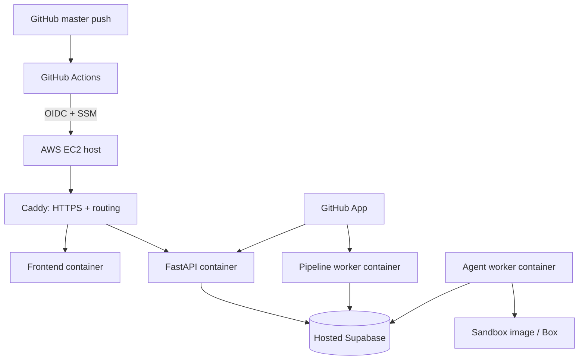

# Comrade deployment

## Live deployment

Comrade is hosted at [https://13-62-11-26.nip.io](https://13-62-11-26.nip.io).

The pilot runs on an AWS EC2 instance in `eu-north-1`, with hosted Supabase for the database, auth, storage, and realtime services.

## Production layout

The host runs Docker Compose services for the frontend, API, pipeline worker, agent worker, and Caddy. Caddy terminates TLS and routes `/api/*` to FastAPI. The agent worker shares the host workspace volume and is the only service allowed to start repository sandbox work.

## Configuration ownership

Secrets are stored on the deployment host and are not committed to Git. They include:

- Supabase project URL, browser anon key, JWT verification secret, and role-specific database URLs.
- Gemini API key and usage limits.
- GitHub App identifiers, private key, OAuth client settings, and webhook secret.
- CORS origin, public host name, workspace root, and sandbox provider settings.

The browser build receives only browser-safe `VITE_*` values. Database role URLs, model credentials, GitHub private material, and sandbox credentials remain server-side.

## Initial deployment sequence

1. Create the hosted Supabase project and apply repository migrations.
2. Create the dedicated worker login roles and grant only their required database access.
3. Configure Supabase Auth redirect/site settings for the public host.
4. Register the GitHub App with its callback and webhook URLs on the public host.
5. Provision the EC2 host with Docker, Docker Compose, Git, persistent workspace storage, and a security group that exposes only HTTPS/HTTP plus restricted administration access.
6. Place production environment settings on the host.
7. Build the repository sandbox image on that host.
8. Start the Compose stack and verify `GET /api/ready` reports database, migration, and agent queue health.

The application must never be deployed ahead of its database migrations. Migrate first, deploy code second, then verify readiness.

## Continuous deployment

The repository’s `.github/workflows/deploy-pilot.yml` is the deployment path.

1. A verified change is merged or committed to `master`.
2. `git push origin master` starts the **Deploy pilot** GitHub Actions workflow.
3. GitHub Actions assumes `ComradePilotGithubDeploy` through GitHub OIDC. Its AWS trust policy permits only this repository’s `master` ref and audience `sts.amazonaws.com`.
4. The workflow sends the exact Git commit SHA to the EC2 host through AWS Systems Manager (SSM).
5. `scripts/deploy_host.sh` checks out that SHA, builds/restarts the Compose services, and waits for readiness.
6. The workflow polls the real SSM terminal state for up to 15 minutes, so a normal Docker build cannot be misreported as failed by the short default waiter.

This makes `master` the production source of truth. Feature branches do not deploy automatically; merge them only after appropriate verification.

## Health checks and troubleshooting

`https://13-62-11-26.nip.io/api/ready` returns a JSON status with three checks:

| Check | Meaning when unhealthy |
|---|---|
| `database` | The API cannot reach the configured database. |
| `migrations` | Application code expects a migration absent from the database history. |
| `agent_queue` | Agent runs are stalled or the worker is not draining the queue. |

Useful production checks:

- GitHub Actions run result for the pushed `master` SHA.
- SSM command result and host container logs.
- Caddy/API logs for HTTP, auth, and routing failures.
- Supabase logs for database, Auth, RLS, Storage, and Realtime failures.
- `agent_runs` and durable agent steps for individual turn failures.

## Operational constraints

- Use a real domain before broad rollout; the current `nip.io` address is suitable for a pilot, not a durable public identity.
- Configure custom SMTP before depending on passwordless-login email at scale; default Supabase email has restrictive rate limits.
- Maintain database backups and rehearse restoration, including recreation of worker login roles.
- Monitor costs, queue depth, errors, and sandbox usage before inviting untrusted teams.
- Treat dependency-environment setup as privileged: it executes a repository’s dependency graph with necessary package-registry network access, even though it receives no Comrade credentials.
- Use GitHub branch protection on `master`; Comrade proposes pull requests and must not be relied on as the sole review gate.
